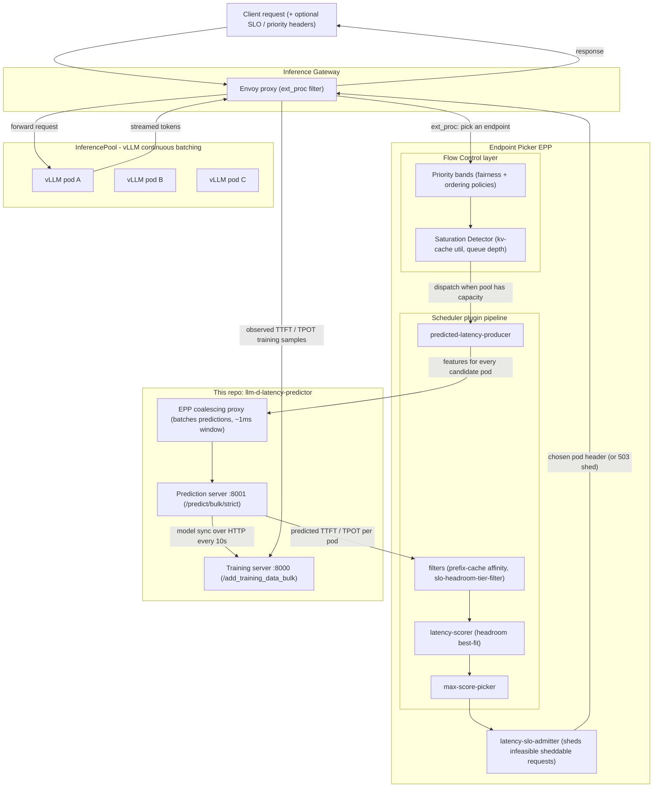
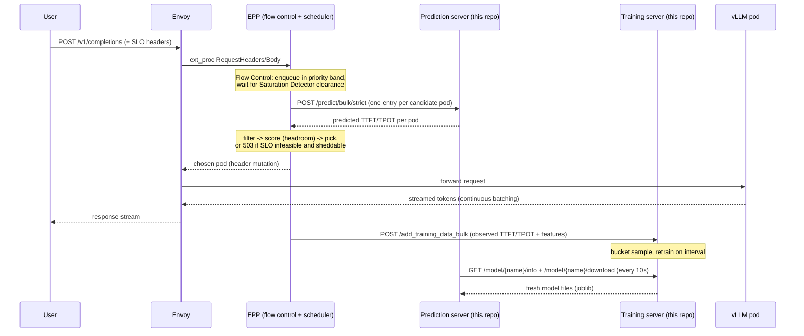
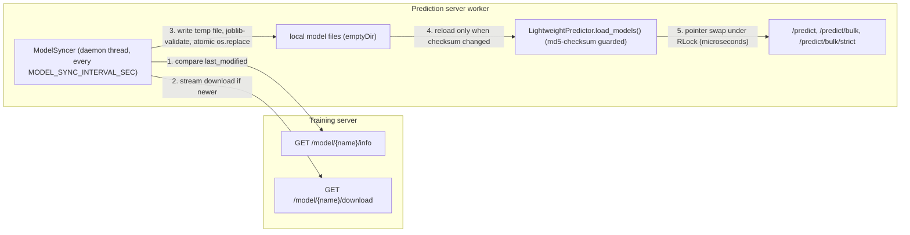
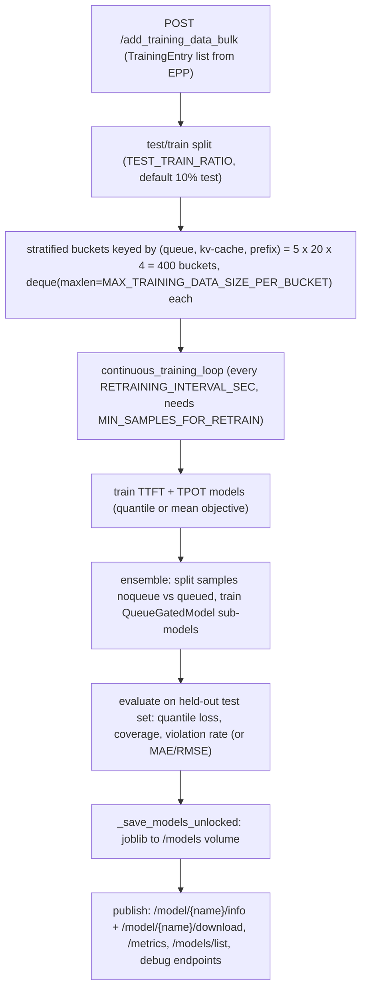

# Architecture

This document describes the end-to-end architecture of **llm-d-latency-predictor** — from a user request entering the Inference Gateway (Envoy), through the Endpoint Picker (EPP) with its flow-control and scheduling plugin pipeline, to the latency predictor served by this repository, on to the chosen vLLM pod, and back to the user — plus the continuous training feedback loop that keeps the models fresh.

Upstream references:

- [Latency-Based Routing guide (gateway-api-inference-extension)](https://gateway-api-inference-extension.sigs.k8s.io/guides/latency-based-predictor/)
- [Flow Control guide (gateway-api-inference-extension)](https://gateway-api-inference-extension.sigs.k8s.io/guides/flow-control/)
- [llm-d blog: Predicted-Latency Based Scheduling for LLMs](https://llm-d.ai/blog/predicted-latency-based-scheduling-for-llms)
- [llm-d-inference-scheduler architecture](https://github.com/llm-d/llm-d-inference-scheduler/blob/main/docs/architecture.md)

## What this repository provides

Two FastAPI services that together implement continuous, online latency prediction for LLM inference scheduling:

- **Training server** ([src/llm_d_latency_predictor/training_server.py](../src/llm_d_latency_predictor/training_server.py), port 8000) — ingests observed `(features, actual TTFT, actual TPOT)` samples from the EPP, keeps them in a stratified sliding window, periodically retrains TTFT and TPOT regression models, and publishes the trained model files over HTTP.
- **Prediction server** ([src/llm_d_latency_predictor/prediction_server.py](../src/llm_d_latency_predictor/prediction_server.py), port 8001) — downloads the latest models from the training server on a background sync loop and serves TTFT/TPOT predictions on the EPP's scheduling hot path, primarily through the bulk endpoint `/predict/bulk/strict`.

The predictions are:

- **TTFT** (time to first token, ms) — dominated by prefill work and queueing.
- **TPOT** (time per output token, ms) — dominated by decode-phase batch contention.

Both can be trained with a **quantile objective** (default p90: "the request will finish faster than this 90% of the time") or a **mean objective**.

## End-to-end request flow

Step by step:

1. **Client → Envoy.** The user sends an OpenAI-style completion request to the Inference Gateway. To opt into SLO-aware scheduling it may add headers: `x-prediction-based-scheduling: true`, `x-slo-ttft-ms: 200`, `x-slo-tpot-ms: 50`.
2. **Envoy → EPP (ext_proc).** Envoy's external-processing filter pauses the request and asks the EPP which pod in the `InferencePool` should serve it.
3. **Flow control (optional layer).** If enabled, the request first enters the EPP's Flow Control layer: it is queued into a priority band, and dispatch only proceeds when the Saturation Detector says the pool has capacity (see [Flow control](#flow-control-layer)).
4. **Prediction fan-out.** The `predicted-latency-producer` plugin gathers, for every candidate vLLM pod, the pod's live state (KV-cache utilization, queue depth, prefix-cache match score, tokens in flight) plus the request's features (input token length), and calls the prediction server. Concurrent per-pod calls are coalesced into one bulk HTTP request (see [Batch inference](#batch-inference)).
5. **Scoring and picking.** The predicted TTFT/TPOT per pod feed the `latency-scorer` (and, when SLO headers are present, the `slo-headroom-tier-filter`). The `max-score-picker` selects the winner; the `latency-slo-admitter` may instead shed the request with a 503 if no pod can meet the SLO and the request is sheddable.
6. **Envoy → vLLM.** Envoy forwards the request to the chosen pod, which serves it with continuous batching, streaming tokens back through Envoy to the user.
7. **Training feedback.** After the response completes, the EPP reports the *observed* TTFT and inter-token latency, together with the features used at scheduling time, to the training server's `/add_training_data_bulk`. The models continuously improve on live traffic — no offline training required.

## Request lifecycle (sequence)

## Flow Control layer

When the EPP's `flowControl` feature is enabled, this repo's predictions operate *behind* a pool-defense layer that decides **when** a request may be scheduled at all:

- **Priority bands.** Each request is assigned a priority (via `InferenceObjective`). Bands are dispatched in strict priority order — higher bands always drain first.
- **Fairness policies** distribute dispatch among flows/tenants inside a band: `global-strict-fairness-policy` or `round-robin`.
- **Ordering policies** order requests within a flow: `fcfs` (first come first served), `edf` (earliest deadline first), and `slo-deadline` — the last of which consumes latency predictions to order requests by how close they are to violating their SLO.
- **Saturation Detector.** Before dispatching, the EPP checks pool health: `kvCacheUtilThreshold` (default `0.8`) and `queueDepthThreshold` (default `5`). If the pool is saturated the dispatch cycle halts (head-of-line blocking is intentional: lower-priority work must not steal the GPU cycles the blocked high-priority request is waiting for).
- **Load shedding.** Requests that would exceed the configured backlog byte limits (`maxBytes`, per-band `maxBytes`/`maxRequests`) are rejected immediately with 503. Without flow control, only negative-priority requests are shed on saturation.

Interaction with this repo: queue depth and KV-cache utilization — the same signals the Saturation Detector monitors — are *input features* of the latency models, and the `latency-slo-admitter` / `slo-deadline` ordering consume this repo's *output*. Flow control decides *when* to dispatch; the latency predictor decides *where*.

## The EPP scheduler plugin pipeline (llm-d plugin catalog)

The EPP is a pluggable scheduler configured by YAML (`EndpointPickerConfig`): **profile handlers** pick a scheduling profile, **filters** prune candidate pods, **scorers** assign weighted scores, and a **picker** selects the winner. The latency predictor coexists with (or replaces) these heuristic plugins:

- **Profile handlers**
  - `single-profile-handler` — default single scheduling profile.
  - `pd-profile-handler` / `disagg-profile-handler` — prefill/decode (P/D) and encode/prefill/decode (E/P/D) disaggregation; runs separate profiles for prefill and decode pods.
  - `disagg-headers-handler` / `prefill-header-handler` — tags requests with phase metadata for disaggregated serving.
- **Filters**
  - `prefill-filter`, `decode-filter`, `encode-filter` — restrict candidates to pods of a given role (this is why the models accept a `pod_type` feature).
  - `by-label` / `by-label-selector` — label-based candidate restriction.
  - `slo-headroom-tier-filter` — *latency-predictor pipeline*: splits pods into a positive tier (predicted to meet SLO) and a negative tier (predicted to violate it), probabilistically exploring the negative tier so recovering pods regain traffic.
- **Scorers** (weights compose additively; typical heuristic defaults shown)
  - `precise-prefix-cache-scorer` (weight 3.0) — real-time KV-block index via KV-Events.
  - `prefix-cache-scorer` — approximate prefix locality from routing history.
  - `kv-cache-utilization-scorer` (weight 2.0) — penalizes pods near KV-cache capacity.
  - `queue-scorer` (weight 2.0) — penalizes pods with deep request queues.
  - `load-aware-scorer`, `active-request-scorer`, `session-affinity-scorer`, `no-hit-lru-scorer` — additional load/affinity heuristics.
  - `latency-scorer` — *latency-predictor pipeline*: replaces/augments the heuristics above with model predictions. Without SLOs it prefers the pod with the lowest predicted latency. With SLOs it computes **headroom** = SLO − predicted (default weighting 80% TTFT / 20% TPOT) and does **best-fit packing**: route to the pod with the *least positive* headroom, keeping other pods free for future requests.
  - `prefix-based-pd-decider` — triggers P/D disaggregation based on uncached token count.
- **Pickers**
  - `max-score-picker` (default) — highest aggregate weighted score wins.
  - `random-picker` — baseline for benchmarking.
- **Latency-predictor pipeline plugins** (enabled with the latency predictor Helm option)
  - `predicted-latency-producer` — calls this repo's prediction server for every candidate pod; after the response, posts the observed sample to the training server.
  - `latency-scorer`, `slo-headroom-tier-filter` — see above.
  - `latency-slo-admitter` — rejects sheddable requests when no pod can meet the SLO.
- **Flow-control policy plugins** — fairness (`global-strict-fairness-policy`, `round-robin`) and ordering (`fcfs-ordering-policy`, `edf-ordering-policy`, `slo-deadline-ordering-policy`).

SLO plugins are no-ops for requests without SLO headers, so the pipeline serves mixed traffic safely.

## Batch inference

Batching happens at three layers, and it is the reason the bulk endpoints exist:

1. **EPP side — coalescing proxy.** Scheduling one request requires one prediction *per candidate pod*, and many requests are scheduled concurrently. A Go coalescing proxy inside the EPP batches all prediction calls that arrive within a ~1ms window into a single `POST /predict/bulk/strict`. Each prediction-server replica sustains roughly 300 QPS of prediction work; replicas are scaled horizontally behind a Service.
2. **Predictor side — the numpy fast path.** `/predict/bulk/strict` calls `LightweightPredictor.predict_batch_fast()`:
   - feature columns are extracted with `np.fromiter` into pre-allocated numpy arrays (no per-request `.dict()` conversion — Pydantic already validated at ingest);
   - DataFrames are built from dict-of-arrays, skipping pandas' per-row type inference (~5x faster than list-of-dicts);
   - model references are snapshotted under the lock, but all heavy work (DataFrame construction, inference) runs outside it;
   - when the gated ensemble is active, the batch is split by regime (`num_request_waiting == 0` → noqueue sub-model, otherwise queued sub-model) using numpy index arrays, and each sub-batch is predicted in one shot;
   - the response is built as plain dicts and serialized with `ORJSONResponse` (native datetime/float handling, much faster than stdlib JSON).
   Training ingestion is batched the same way: the EPP posts many observed samples at once to `/add_training_data_bulk`.
3. **Model-server side — vLLM continuous batching.** vLLM dynamically batches prefill and decode work across in-flight requests. This is precisely why `num_request_waiting`, `num_request_running`, `kv_cache_percentage`, and tokens-in-flight are predictive: they describe the batch contention a new request will experience.

## Inside the prediction server

Key mechanics:

- **Download safety.** Each file is streamed to a unique temp file (`pid`-prefixed, safe across uvicorn workers), validated for size (Content-Length) and integrity (`joblib.load` must succeed), then atomically `os.replace`d into place.
- **Multi-worker note.** With N uvicorn workers, only one wins the download race each cycle, so every worker calls `load_models()` unconditionally each sync tick; the checksum early-return makes the no-change case cheap.
- **Lock discipline.** `predict*()` snapshots model references under the `RLock`, then releases it before DataFrame construction and inference. `load_models()` deserializes outside the lock and holds it only for the pointer swap.
- **Model types.** XGBoost (default), LightGBM, or Bayesian Ridge (with StandardScaler; supports analytic uncertainty via `return_std`). If the configured library is unavailable at import time the server falls back to Bayesian Ridge.
- **Gated ensemble.** When `LATENCY_ENSEMBLE_MODE=true` and the gated files exist, prediction routes each request by queue regime: `num_request_waiting == 0` → *noqueue* sub-model (queue features dropped), otherwise → *queued* sub-model. This separates the "idle pod" and "contended pod" latency distributions, which behave very differently.

## Inside the training server

- **Stratified sliding window.** Samples are bucketed by `(queue_bucket, cache_bucket, prefix_bucket)` — queue: `{0, 1-2, 3-5, 6-10, 11+}`; KV-cache: 5% increments; prefix score: quartiles. Each bucket is a bounded deque, so rare traffic regimes (e.g. deep-queue, cold-cache) are never crowded out by the common case. `RandomDropDeque` evicts a *random* element when full, preserving distribution over time.
- **Retraining cadence.** A daemon thread retrains every `LATENCY_RETRAINING_INTERVAL_SEC` once `LATENCY_MIN_SAMPLES_FOR_RETRAIN` samples exist (a lower fresh-start threshold applies to the first model).
- **Objectives.** `quantile` (default, `LATENCY_QUANTILE_ALPHA=0.9`) trains pinball-loss models (XGBoost/LightGBM quantile objective; Bayesian Ridge via mean + z·std); `mean` trains standard regressors. Quantile quality is tracked with quantile loss, empirical coverage, and violation rate on the held-out test set, exposed at `/metrics` (Prometheus format).
- **Model publishing.** The trained artifacts are served over plain HTTP: `/model/{ttft|tpot|ttft_scaler|tpot_scaler|ttft_gated|tpot_gated}/info` and `/download`, plus interpretability endpoints (`/model/*/xgb/json`, `/model/*/lgb/txt`, `/model/*/lgb/importances`, coefficient dumps for Bayesian Ridge) and `/debug/prefix_distribution`. Operational endpoints: `/flush` (reset data/metrics), `/data/status`.

## Features

Required in every prediction/training request:

- `kv_cache_percentage` (0.0–1.0) — target pod's KV-cache utilization.
- `input_token_length` — prompt length in tokens.
- `num_request_waiting` — pod's queue depth.
- `num_request_running` — pod's running request count.
- `num_tokens_generated` — tokens generated so far (TPOT models; 0 at admission).
- `prefix_cache_score` (0.0–1.0) — fraction of the prompt prefix already cached on that pod.

Optional:

- `pod_type` — `"prefill"`, `"decode"`, or `""` (monolithic); supports P/D-disaggregated pools.
- `prefill_tokens_in_flight`, `decode_tokens_in_flight` — in-flight token load (enabled by `LATENCY_ENABLE_TOKEN_IN_FLIGHT_FEATURES`).

Engineered at feature-preparation time (identically in **both** servers — see the invariant below):

- `is_queued` — binary `num_request_waiting > 0`; gives trees a clean idle-vs-contended split.
- `effective_input_tokens` — `(1 − prefix_cache_score) × input_token_length`; the prefill work that actually remains (TTFT only).
- `prefill_score_bucket` — categorical quartile of `prefix_cache_score` (TTFT only).
- `pod_type_cat` — categorical encoding of `pod_type`.

> **Invariant:** `_prepare_features_with_interaction()` and `_prepare_features_for_ensemble()` exist in *both* `training_server.py` and `prediction_server.py` and must produce identical columns in identical order. Any drift silently corrupts predictions.

## Deployment topologies

**1. Standalone dual-server (this repo's manifests).** [deploy/dual-server-deployment.yaml](../deploy/dual-server-deployment.yaml): one training-server Deployment (models persisted on a `ReadWriteOnce` PVC) plus a horizontally scaled prediction-server Deployment (10 replicas, per-pod `emptyDir` model cache). Models move over HTTP only — no `ReadWriteMany` volume needed. Services: `training-service:8000` (ClusterIP), `prediction-service:80→8001` (LoadBalancer). [deploy/test-dual-server-deployment.yaml](../deploy/test-dual-server-deployment.yaml) runs the integration test client ([tests/test_dual_server_client.py](../tests/test_dual_server_client.py)) as a Job.

**2. EPP sidecar (upstream production topology).** The training and prediction servers run as sidecar containers of the EPP pod (enabled via the inference-gateway Helm chart's latency-predictor option). The EPP talks to them over localhost; its coalescing proxy load-balances multiple prediction sidecars. Same images, same API — only the wiring differs.

## Configuration reference

Prediction server (`PredictSettings`):

- `TRAINING_SERVER_URL` (default `http://training-service:8000`) — where to sync models from.
- `LOCAL_TTFT_MODEL_PATH`, `LOCAL_TPOT_MODEL_PATH`, `LOCAL_TTFT_SCALER_PATH`, `LOCAL_TPOT_SCALER_PATH` (defaults under `/local_models/`) — local model cache paths.
- `LOCAL_TTFT_GATED_MODEL_PATH`, `LOCAL_TPOT_GATED_MODEL_PATH` — gated ensemble cache paths.
- `MODEL_SYNC_INTERVAL_SEC` (default `10`) — sync loop period.
- `LATENCY_MODEL_TYPE` (default `xgboost`) — `xgboost` | `lightgbm` | `bayesian_ridge`.
- `LATENCY_QUANTILE_ALPHA` (default `0.9`) — target quantile.
- `LATENCY_OBJECTIVE_TYPE` (default `quantile`) — `quantile` | `mean`.
- `LATENCY_ENSEMBLE_MODE` (default `true`) — enable queue-gated ensemble.
- `LATENCY_ENABLE_TOKEN_IN_FLIGHT_FEATURES` (default `true`) — include tokens-in-flight features.
- `PREDICT_HOST` (default `0.0.0.0`), `PREDICT_PORT` (default `8001`).
- `HTTP_TIMEOUT` (default `30`), `DOWNLOAD_RETRIES` (default `3`) — sync HTTP behavior (retries with backoff on 502/503/504).

Training server (`Settings`):

- `LATENCY_TTFT_MODEL_PATH`, `LATENCY_TPOT_MODEL_PATH`, `LATENCY_TTFT_SCALER_PATH`, `LATENCY_TPOT_SCALER_PATH` (defaults under `/tmp/models/`) — model artifact paths.
- `LATENCY_TTFT_GATED_MODEL_PATH`, `LATENCY_TPOT_GATED_MODEL_PATH` — gated ensemble artifact paths.
- `LATENCY_RETRAINING_INTERVAL_SEC` (default `1800`) — retraining period.
- `LATENCY_MIN_SAMPLES_FOR_RETRAIN` (default `1000`), `LATENCY_MIN_SAMPLES_FOR_RETRAIN_FRESH` (default `10`) — sample thresholds.
- `LATENCY_MAX_TRAINING_DATA_SIZE_PER_BUCKET` (default `500`) — per-bucket window size.
- `LATENCY_TEST_TRAIN_RATIO` (default `0.1`), `LATENCY_MAX_TEST_DATA_SIZE` (default `1000`) — held-out test set.
- `LATENCY_MODEL_TYPE`, `LATENCY_QUANTILE_ALPHA`, `LATENCY_OBJECTIVE_TYPE` — as above.
- `LATENCY_ENSEMBLE_MODE` (default `true`), `LATENCY_MIN_SAMPLES_FOR_ENSEMBLE_SPLIT` (default `200`) — gated ensemble control.
- `LATENCY_TPOT_ZERO_TOKEN_COUNT` (default `true`) — include zero-token samples in TPOT training.
- `LATENCY_SAMPLE_WEIGHTING_FOR_PREFIX_CACHE` (default `false`) — up-weight high-prefix-score samples.
- `LATENCY_ENABLE_TOKEN_IN_FLIGHT_FEATURES` (default `true`) — as above.

## HTTP API summary

Prediction server (:8001): `POST /predict`, `POST /predict/bulk`, `POST /predict/bulk/strict` (fast path used by the EPP), `POST /reload`, `GET /status`, `GET /healthz`, `GET /readyz`.

Training server (:8000): `POST /add_training_data_bulk` (used by the EPP), `POST /predict` (with uncertainty bounds), `GET /model/{name}/info`, `GET /model/{name}/download`, `GET /models/list`, `GET /metrics` (Prometheus), `POST /flush`, `GET /data/status`, `GET /healthz`, `GET /readyz`, plus model-introspection endpoints (`/model/*/xgb/json`, `/model/*/lgb/txt`, `/model/*/lgb/importances`, `/debug/prefix_distribution`).

> The endpoints marked "used by the EPP" are consumed by `predicted-latency-producer` in gateway-api-inference-extension / llm-d. Treat their request/response schemas as a public API: breaking changes require coordination with the upstream EPP code.
